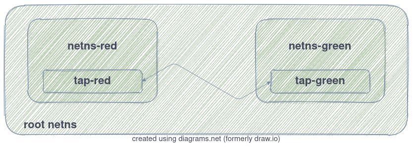
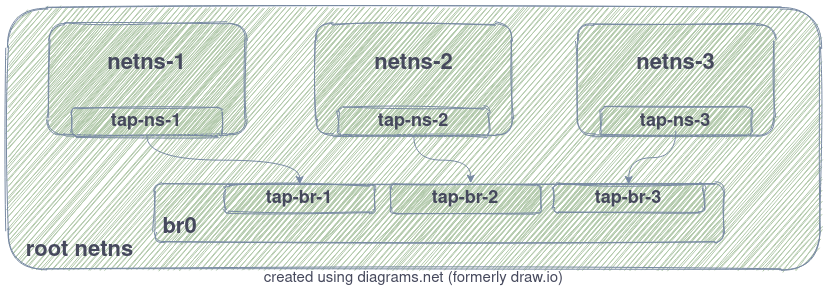
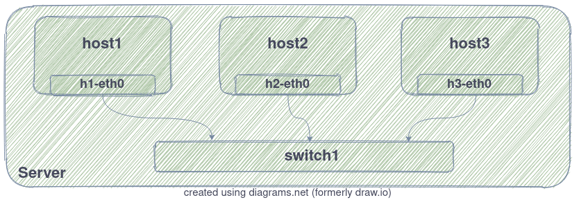
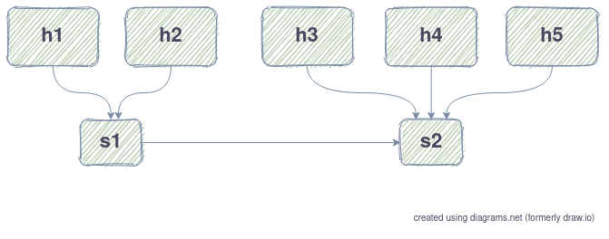

# TP 2: An Introduction to Software Defined Networking (SDN)
 
- **Related course module**: IR.3503 - Virtual Infrastructure
- **Tutorial scope**: Software Defined Networking
- **Technologies**: Linux, Open vSwitch (OVS), Mininet, Open Network Operating System (ONOS)

During this tutorial, we will learn few things like:
- Linux Virtual Networking Devices
- Virtual Network Infrastructure
- Testing a Simple SDN Infrastructure

> In the following, you will see `Discover` if you should play around
> and see the documentation or test. You will see `Action` if you should
> run a command, write a program, or something similar. You will see `Question` when there is a question to provide an answer to.

> Note: when you find something like `<something-to-be-replaced>` in a command, this mean that you need to update that part of the command.

Voucher Link:

<a href="https://www.digitalocean.com/?refcode=ef5a5f3726df&utm_campaign=Referral_Invite&utm_medium=Referral_Program&utm_source=badge"></a>

## Prerequisites

These prerequisites only concern you if you will use a Virtual Machine (VM) on a public cloud to execute the different steps. For that, you need to have:

- Windows Users: an **ssh client** already configured on you desktop (I recommend using [mobaxterm](https://mobaxterm.mobatek.net/download.html) for windows users)
- MAC Users: shell + [XQuartz](https://www.xquartz.org/)
- pick an **account** from the accounts csv file containing: VM's public IP address and credentials needed for connecting

> Note: you need to **enables X11 forwarding** on you ssh session (will be needed for the 1st part of the TP)

## Before you start

I recommend that you create a text file with your favorite editor where you will continuously copy the commands and their output to help you with your TP report.

> Please note that the **VM will be destroyed** upon finishing the TP with a **grace period of 1 hour** approximately.

## Linux Virtual Networking Devices (~30 minutes)

In the [previous tutorial](https://github.com/LesFacilitateurs/tutorials/tree/master/01-containers-in-practice) about containers, we used some Linux commands (short form) to get information about system networking:

```console
ip address
ip route
```

**ip** is a powerful tool to show and manipulate routing, network devices, interfaces and tunnels. In the following we will test new **ip** objects and commands.

### TUN/TAP virtual devices

`Discover`

- https://www.kernel.org/doc/html/latest/networking/tuntap.html

`Question`

- What *TUN* and *TAP* devices can be used for ?
- What is the difference between *tap* and *tun* devices ?

The following **ip** commands will help you create *tun* and *tap* devices.

`Action`

First, create a TUN device with the name: **tun0**

```console
ip tuntap add tun0 mode tun
ip link set dev tun0 up
```

Verify that the command was executed correctly:

```console
ip link show tun0
ip link show type tun # (alternative 1)
ip addr # (alternative 2)
```

`Question`

- Does **tun0** have a MAC (Media Access Control) address ? Explain why ?

In the same way, create a TAP device and verify that is was correctly created.

`Action`

First, create a TAP device with the name: **tap0**

```console
ip tuntap add tap0 mode tap
ip link set dev tap0 up
```

Verify that the command was executed correctly:

```console
ip link show tap0
ip link show type tun # (alternative 1)
ip addr # (alternative 2)
```

`Discover` + `Question`

- Does **tap0** have a MAC (Media Access Control) address ? Explain why ?
- What is the status of **tap0** interface ? Explain why ?

Let's create an application (with a basic configuration that serves the goal of this tutorial) that actually will use **tap0**. First, you need to download [Tiny Core Linux](http://tinycorelinux.net/) which is one of smallest Linux OS distributions.

> Note: Enable X11 forwarding on your SSH session using: `ssh -X username@ip`. For windows users, it is activated by default in mobaxterm.

`Action`

Start by downloading the *Core* version of **Tiny Core** which is only 15MB in size.

```console
wget http://tinycorelinux.net/11.x/x86/release/Core-current.iso
```

The application you are going to create is a Virtual Machine (VM) that will be created using QEMU/KVM. **tap0** will be provided to QEMU to setup the virtual network interface of the VM.

But first, you need to install *qemu-kvm* on you system:

```console
apt-get update && apt-get install qemu-kvm
```

Then fire up the VM:

```console
qemu-system-i386 -boot d \
    -netdev tap,id=net0,ifname=tap0,script=no,downscript=no \
    -device virtio-net,netdev=net0 \
    -cdrom Core-current.iso
```

In a seprate terminal, verify the state of **tap0**

`Question`

- What do you notice ?

`Action`

Close the VM interface and re-verify the state of **tap0**

### VETH virtual devices

`Discover`

- https://man7.org/linux/man-pages/man4/veth.4.html

`Question`

- What *veth* devices can be used for ?

*veth* pair devices, as the name suggests, are always created in pairs. Use the follwing command to create a pair of veth endpoints:

```console
ip link add veth-tap1 type veth peer name veth-tap2
```

Examine the result using:

```console
ip link show
ip link show type veth # (alternative)
```

`Question`

- Can *veth* devices operate on the data link layer of the OSI model ? and why ?

### Bridge devices

`Discover`

- https://tldp.org/HOWTO/BRIDGE-STP-HOWTO/what-is-a-bridge.html
- https://tldp.org/HOWTO/BRIDGE-STP-HOWTO/rules-on-bridging.html
- https://wiki.linuxfoundation.org/networking/bridge

` Question`

- Linux bridge is equivalent to a router, switch or both ?
- In which level of the OSI model a linux bridge operates ?
- Can a bridge have an IP address ? If yes, what for ?

`Action`

Now, create a bridge using the following command:

```console
ip link add br0 type bridge
```

and examine the result with:

```console
ip link show type bridge
```

### More virtual devices

`Discover`

More details about different virtual devices **ip** can create are available [here](https://developers.redhat.com/blog/2018/10/22/introduction-to-linux-interfaces-for-virtual-networking/).

### Miscellaneous

`Question`

- How to get interfaces list in JSON format using **ip** ?
- How to show more details about a given interface using **ip** ?

### Clean up

Before moving to the following section, remove the previously created devices (tap0, tun0, veth-tap1/2, and br0):

> **Warning**: please make sure not to remove legitimate network interfaces, otherwise your VM won't be accessible again !

```console
ip link del <device-name>
```

## Virtual Network Infrastructure (~45 minutes)

### **veth** pairs in practice

*veht* pairs could be used in multiple ways. In the following, we will use them in two simple scenarios
- 1st scenario: to communicate between two network namespaces (you can also think network containers !)
- 2nd scenario: to communicate between a network namespace and the host network

#### 1st Scenario

The following figure illustrates the setup of this scenario.

<p align="center"></p>

`Action`

Create *red* and *green* network namespaces using, gess what ?, **ip**

```console
ip netns add netns-red
ip netns add netns-green
```

List the network namespaces on your system:

```console
ip netns
ip net # (equivalent)
```

Create a pair of network devices of type veth with the following names: *tap-red* and *tap-green*. Then list the available *veth* devices.

Move each *tap* endpoint device to its corresponding network namespace:

> **Warning**: please make sure to run the following command only on the tap devices you created. If you use it against a legitimate network interface, you may loose access to you VM permanently.

```console
ip link set <tap-name> netns <netns-name>
```

List again the available *veth* devices.

`Question`

- What do you notice ?

To run networking commands inside a network namepace you can do:

```console
ip netns exec <netns-name> <cmd>
```

E.g. of commands:

- `ip a`
- `ip r`

`Action`

- List the network devices inside both *netns-red* and *netns-green*
- List the configred routes in each namespace

`Question`

- What do you notice ?

`Action`

Now let's add IP address `10.100.100.1/30` to *tap-red* and `10.100.100.2/30` to *tap-green*:

```console
ip netns exec <netns-name> ip addr add <ip-address> dev <tap-name>
```

Then, bring up both *veth* endpoints:

```console
ip netns exec <netns-name> ip link set dev <tap-name> up
```

Verify that both devices are up and that their IP addresses are correctly configured.

> Tip: You can use `bash` as a `<cmd>` to start a bash process inside your network namespace

Now start another terminal; in you first terminal execute:

```console
ip netns exec netns-green tshark -i tap-green
```

In you second terminal:

```console
ip netns exec netns-red ping -c4 10.100.100.2
```

where `10.100.100.2` is the IP@ of the *netns-green*'s *tap-green* device.

You normally should see successful ICMP packets running between red and green namespaces.

Finally, clean things up using:

```console
ip netns del <netns-name>
```

#### 2nd Scenario

This 2nd setup is illustrated by the following figure:

<p align="center"></p>

`Action`

- Create a *veth* pair with peer names: *tap0* and *tap1*
- Create a network namespace named: *netns-1*
- Move *tap1* to *netns-1*
- Configure *tap0* with IP@: `192.168.100.100/24`
- Configure *tap1* with IP@: `192.168.100.101/24`
- Bring both *tap0* and *tap1* UP
- Start a tshark on *tap0*
- From *netns-1*, ping *tap0* IP@ and make sure that you get echo replies

### Create a virtual sub-network using **Linux bridge**

Using *veth* pairs, we can only establish point-to-point connections between network containers. Multiple network namespaces can be interconnected to create a complete sub-network using a *bridge*. In the following, you will see how this could be done using 3 network namespaces, 3 *veth* pairs, and a *bridge*. This is illustrated in the following figure:

<p align="center"></p>

`Action`

Use the provided script `subnet-with-linux-bridge.sh` to create the infrastructure:

A sample output:

```console
./subnet-with-linux-bridge.sh create
dim. 22 nov. 2020 16:38:41 CET | INFO | create bridge with name br0
dim. 22 nov. 2020 16:38:41 CET | INFO | fire up br0
dim. 22 nov. 2020 16:38:41 CET | INFO | create netns netns-1
dim. 22 nov. 2020 16:38:41 CET | INFO | create veth pairs for netns number 1
dim. 22 nov. 2020 16:38:41 CET | INFO | move tap-ns-1 to netns-1
dim. 22 nov. 2020 16:38:41 CET | INFO | attach tap-br-1 to br0
dim. 22 nov. 2020 16:38:41 CET | INFO | add 10.200.200.1/24 ip address to tap-ns-1
dim. 22 nov. 2020 16:38:41 CET | INFO | bring up tap-br-1
dim. 22 nov. 2020 16:38:41 CET | INFO | bring up tap-ns-1
dim. 22 nov. 2020 16:38:41 CET | INFO | create netns netns-2
dim. 22 nov. 2020 16:38:41 CET | INFO | create veth pairs for netns number 2
dim. 22 nov. 2020 16:38:41 CET | INFO | move tap-ns-2 to netns-2
dim. 22 nov. 2020 16:38:41 CET | INFO | attach tap-br-2 to br0
dim. 22 nov. 2020 16:38:41 CET | INFO | add 10.200.200.2/24 ip address to tap-ns-2
dim. 22 nov. 2020 16:38:41 CET | INFO | bring up tap-br-2
dim. 22 nov. 2020 16:38:41 CET | INFO | bring up tap-ns-2
dim. 22 nov. 2020 16:38:41 CET | INFO | create netns netns-3
dim. 22 nov. 2020 16:38:41 CET | INFO | create veth pairs for netns number 3
dim. 22 nov. 2020 16:38:41 CET | INFO | move tap-ns-3 to netns-3
dim. 22 nov. 2020 16:38:41 CET | INFO | attach tap-br-3 to br0
dim. 22 nov. 2020 16:38:41 CET | INFO | add 10.200.200.3/24 ip address to tap-ns-3
dim. 22 nov. 2020 16:38:41 CET | INFO | bring up tap-br-3
dim. 22 nov. 2020 16:38:41 CET | INFO | bring up tap-ns-3
dim. 22 nov. 2020 16:38:41 CET | INFO | done
```

`Discover`

Prior to **ip** and **bridge** (not used in this TP), linux bridge manipulation was done through **brctl**. It is used in the following for the sake of habit and simplicity.

```console
man brctl
man bridge
man ip
```

> Note: virtual and physical network interfaces attached to a linux bridge are simply considered as ports: think ports of a layer 2 switch !

`Action`

- Start a tshark on br0 to listen to ICMP packets
- Ping a *netns-x* from a *netns-y* where x,y are in [1,2,3]
- List network interfaces attached to *br0* using `brctl`
- Inspect the learned MAC addresses on *br0* using `brctl`
- Inspect the leaned MAC addresses on each *netns* using `arp -n`

> Note: ping *netns-x* from *netns-x* doesn't work because the loopback interface "lo" is down !

Once you finish, wipe everything out using:

```console
./subnet-with-linux-bridge.sh delete
```

### Create a virtual sub-network using **Open vSwitch** virtual switch

In the following we will re-create the same configuration but using Open vSwitch (OVS) software switch. The configuration is depicted in the following figure:

<p align="center"></p>

`Discover`

- https://docs.openvswitch.org/en/latest/intro/what-is-ovs/
- https://docs.openvswitch.org/en/latest/faq/openflow/

`Question`

- What are the main components of OVS ?
- What is the role of these two components: *ovs-vswitchd* and *ovsdb-server* ?

`Action`

Let's start by installing OVS:

```console
apt-get update && apt-get install -y openvswitch-switch
```

Verify that *ovs-vswitchd* and *ovsdb-server* are up and running on your system:

```console
ps aux |grep ovs
/lib/systemd/system/openvswitch-switch.service (alternative)
```

`Question`

- Which OpenFlow version/s are supported by your OVS virtual switch ?

`Action` + `Question`

- Use the provided bash script `subnet-with-openvswitch.sh` to create the infrastructure
- Start a *tshark* or a *tcpdump* on *switch1* to listen to ICMP packets
- Ping a *netns-x* from a *netns-y* where x,y are in [1,2,3] (What do you notice ?)
- Use *ovs-tcpdump* instead of *tshark* to listen to ICMP packets one of the 3 ports and redo the previous step
- List ports attached to *switch1* using `ovs-vsctl`
- List network devices using `ip link show` (What do you notice ?)

> Note: when you create your first OVS bridge, a bridge named `ovs-system` is automatically created. The explanation of what it is and what it does can be found here: https://mail.openvswitch.org/pipermail/ovs-discuss/2013-October/031532.html

`Question`

- Which command is used to add an OVS port to an OVS bridge ?

Once you finish, wipe everything out using:

```console
./subnet-with-openvswitch.sh delete
```

`Discover`

OpenStack uses Linux bridge and OVS to setup networking on compute nodes at a large scale: https://docs.openstack.org/neutron/victoria/contributor/internals/openvswitch_agent.html

## Testing a Simple SDN Infrastructure (~45 minutes)

In this section, we are going to setup a basic SDN infrastructure/lab using **Mininet** network emulator and **Open Network Operating System (ONOS)** SDN controller.

`Discover`

- http://mininet.org/
- http://mininet.org/overview/
- https://github.com/mininet/mininet
- https://wiki.onosproject.org/display/ONOS/System+Components
- https://wiki.onosproject.org/display/ONOS/Requirements
- https://www.iana.org/assignments/service-names-port-numbers/service-names-port-numbers.xhtml

`Question`

- In which language mininet is written ?
- What does mininet use to create virtual hosts, switches and links ?
- What is a Provider in ONOS ?
- Which port is used by OpenFlow ?

### Mininet Setup

`Action`

Install *mininet* on you system using:

```console
apt-get update && apt-get install -y mininet
```

`Question`

Using the help of the *mininet* CLI:

- What are the supported software switches ? ans which is the default one ?

`Action`

Run a fist test of mininet:

```console
mn --test pingall
```

`Question`

- What this test is doing ?

### ONOS Setup

`Action`

Install Docker Engine in your system using: https://docs.docker.com/engine/install/ubuntu/#installation-methods

Launch ONOS docker container using:

```console
docker run -it --rm \
    --name onos-sdn-controller \
    -p 6653:6653 \
    -p 6640:6640 \
    -p 8181:8181 \
    -p 8101:8101 \
    onosproject/onos
```

> Note: execute the following steps in a second terminal

`Question`

- What is the protocol or application running on each of those ports ?

This is a sample output log of ONOS startup:

```console
...
14:56:46.559 INFO  [FlowRuleManager] Configured. FallbackFlowPollFrequency is 30 seconds
14:56:46.568 INFO  [NeighbourResolutionManager] IPv6 neighbor discovery is disabled
14:56:46.568 INFO  [NeighbourResolutionManager] Address resolution protocol is enabled
14:56:46.569 INFO  [NeighbourResolutionManager] Configured. Request intercepts is enabled
14:56:46.613 INFO  [GroupManager] Configured. PurgeOnDisconnection is disabled
14:56:46.617 INFO  [HostManager] Configured. monitorHosts disabled
14:56:46.618 INFO  [HostManager] Configured. probeRate 30000
14:56:46.618 INFO  [HostManager] Removal of duplicate ip address is disabled
14:56:46.619 INFO  [HostManager] Configured. greedyLearningIpv6 disabled
14:56:46.619 INFO  [HostManager] Configured. hostMoveTrackerEnabled disabled
14:56:46.629 INFO  [MeterManager] Configured. PurgeOnDisconnection is disabled
14:56:48.203 INFO  [AtomixClusterStore] Updated node 172.17.0.2 state to READY
```

You need to do some additional configuration using ONOS CLI which is accessible via SSH on port 8101 (password: karaf):

```console
ssh -p 8101 -o StrictHostKeyChecking=no karaf@localhost
```

Once you login, execute the following ONOS command:

```console
app activate org.onosproject.openflow-base \
    org.onosproject.lldpprovider \
    org.onosproject.hostprovider \
    org.onosproject.drivers \
    org.onosproject.openflow \
    org.onosproject.proxyarp \
    org.onosproject.fwd
```

Finally, navigate to `http://<public-ip>:8181/onos/ui` and login using the same credentials: karaf/karaf

> Note: Press the **H** key on your keyboard to activate/deactivare hosts visibility in the network topology.

### Network topologies

Mininet allows creating multiple network topologies. Let's start by a simple one:

```console
mn --controller=remote --topo=minimal --switch default,protocols=OpenFlow14
```

Once the topology is created, allow your infrastructure switches learn about the available hosts, simply by letting them ping each other:

```console
mininet> pingall
```

Observe the topology on ONOS web UI.

`Action`

Execute the following steps to answer the question that follows:

- Stop any running mininet topology
- Use tshark to listen on the OpenFlow port 
- Launch a mininet topology of your choice (minimal may be a good choice)

`Question`

- What transport protocol is used by OpenFlow ?
- Is it the switch or the controller that initiated the session ?
- What is the first OpenFlow message ?

`Discover`

Mininet can be used to create more advances topologies. Test some of them and see their visual representation on the web UI.

`Discover` + `Action`

- Refer to http://mininet.org/walkthrough/#custom-topologies to learn how to create a custom topology.
- Create a python file containing the topology depicted by the following figure (put the content of this file in your report)
- Test your topology with mininet

<p align="center"></p>


### ONOS REST API

ONOS provides a REST API to manage the network infrastructure. The documentation of this API is provided in OpenAPI standard an can be found here: `http://<public-ip>:8181/onos/v1/docs/`

`Action`

- Use the API to get the network topology in two ways
    - using the OpenAPI web UI
    - using *cURL* in combination with `jq`

## EOF
